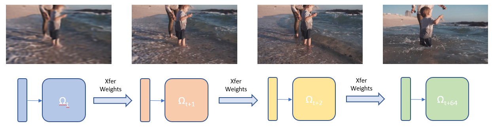
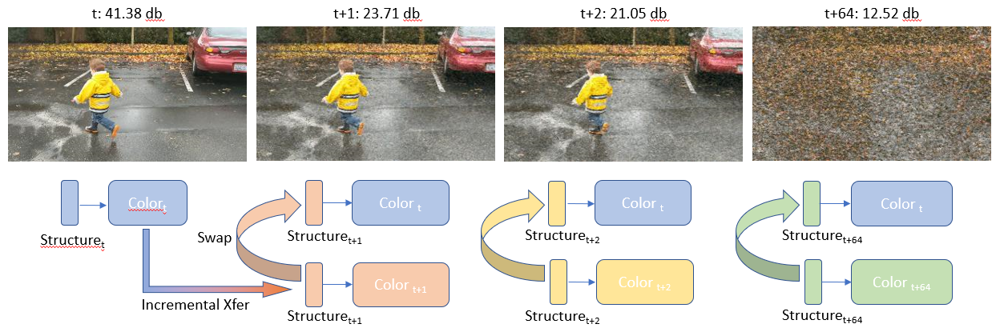
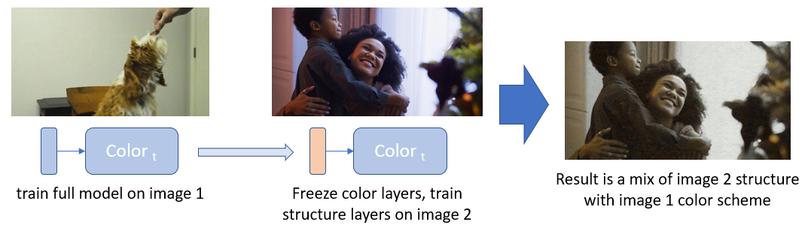
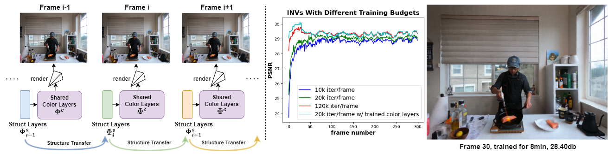

# INV: Understanding Functionalities Of MLPs Layers To Design Efficient Representations For Incremental Neural Videos
Shengze Wang, Alexey Supikov, Joshua Ratcliff, Ronald Azuma


**TL;DR** INVs is a fast incremental representation for neural videos. Each frame can be trained in under 10 minutes 
using vanilla NeRF and still achieve good quality (>28db). It only takes around 300kb to store each frame/NeRF, making 
this representation streamable. Moreover, INV can achieve state-of-the-art per-frame image quality and competitive 
stability with less training budgets than prior SOTAs.<br />
<br />
<br />

**INV**<br />
INV is designed to incrementally generate neural 3D videos frame by frame, and it utilizes knowledge of prior frames to
drastically reduce both training time and storage. Our design is based on two insights:<br />
&emsp; (1) We discovered that MLPs automatically partition themselves into Structure and Color Layers, which store
structural and color/style information respectively. <br />
&emsp; (2) We leverage this property to retain and improve upon previously learned information. This allows us to reduce 
redundancies in training and storage. We could thus amortize training across frames.


## Setup
```
https://github.com/intel-collab/applications.ai.neural-video.progressive.git INV
cd INV
git checkout INV_finalized
```

#### FF+Siren (./2D_experiments/)
None<br />
<br />

#### NeRF (./3D_experiments/)
[NeRF setup](./nerf-pytorch/README.md)<br />
<br />

## Experiments
To conduct further experiments in 2D, follow (1) to get the required data first.
### 1. 2D Incremental Transfer: Generating frame-by-frame models for 2D videos 
[//]: # (Makes training faster and better PSNR)
[//]: # (<br />)
[//]: # (<br />)
<details>
  <summary> More Info (click to expand) </summary>
Incremental Transfer encodes a video by training one MLP per frame. It uses the MLP from a previous frame as the 
initialization for the later frame. By analyzing the changes in each layer, we found that changes in earlier layers 
induce structural changes, and changes in later layers induce color/style changes.

First, run Incremental Transfer training by calling:
```commandline
python 2D_experiments\neural_video.py
```
runs according to settings in `2D_experiments\const.py`. Most important args are:<br />
`is_vid`:&emsp; indicates whether this is a video file or a sequence of images.<br />
`vid_path`:&emsp; either a folder that contains `frames/` folder or a video file. Result stored in the parent folder of the 
video for `frames/` folder<br />
`per_frame_train_iters`:&emsp; number of itertions for each frame<br />
`start_frame`:&emsp; the starting frame<br />
`img_downsample`:&emsp; the downsampling factor. To accelerate training, use a larger (e.g. 4 or 8) factor, but make sure frame 
size is divisible by this numer. <br />
`no_siren_only_mlp`:&emsp; To use basic MLP instead of MLP. Default `True`. <br />
`use_nerf_pe`:&emsp; use NeRF positional encoding (i.e. sin & cos for xyz separately). Default `True`. If `False`, will use 
Fourier Features where xyz encoded together via sin & cos and random frequencies. Similarly, haven't tested for a while.  

<br />

#### Results
`vid_path/imgs_incremental`:&emsp; renderings from INV<br />
`vid_path/models_incremental`:&emsp; models for each frame. Note that the entire models are stored, although only the 
structure layers (1st layer by default) are different.<br />

</details>
<br />
<br />

### 2. 2D Structure Swap visualizes structural knowledge in Structure Layers
<details>
  <summary> More Info (click to expand) </summary>

***Structure Swap:*** structure layers could be directly plugged into a pretrained color layer
from a different frame without any training.<br />
<br />
<br />

***Current Observations:***
1. Positional Encodings are needed to activate structure and color 
layers.
   1. SIREN layers are not required, but accelerates training.
   2. NeRF P.E. and Fourier Features activate Structure Layers.<br /> 
   Note: They have different artifacts (e.g. NeRF P.E. 
is horizontal/vertical stripes, but FF show blobs). This is likely because FFs encode xyz's together

<br />
<br />

To run Structure Swap experiments:
```commandline
python 2D_experiments\swap_1st_layer.py
```
Uses the per-frame models stored in `vid_path/models_incremental` to swap.<br />
Also uses the same configs (i.e. `2D_experiments\const.py`) as before, except that it uses: <br />
`do_color_scheme_transfer`:&emsp; Variable in the `swap_1st_layer.py` script. Should be `False`. Used later in `2D Color Transfer` Section.<br />
`base_frame`:&emsp; Variable in the `swap_1st_layer.py` script. The base model/frame. <br />
The script keeps later layers of the `base_frame` fixed, and swaps the Structure Layer (1st layer) from later frames 
into this base frame.<br />
`vid_path/imgs_swap_1st_raw`:&emsp; Resulting rendering of these swaps. Notice that the further in time from the base 
frame, the worse the result would be. Such degradation is more prominent in 2D than in 3D.<br /> 
`vid_path/imgs_swap_1st_refined`:&emsp; After swapping, the new structure layer are also optimized and stored in this 
folder. The resulting renderings after optimization usually have high quality.


</details>
<br />
<br />
<br />

### 3. 2D Color Transfer visualizes Color Knowledge in Color Layers
<details>
  <summary> More Info (click to expand) </summary>

***Color Transfer:*** Mixing color and structure knowledge from different images
<br />
```commandline
python 2D_experiments\color_scheme_transfer.py
```
<br />

Arguments:<br />
`base_folder`:&emsp; folder containing the two images.<br />
`structure_fn`:&emsp; which image to use as structure information. <br />
`color_fn`:&emsp; which image to use as color information. <br />
###### Output  
`{base_folder}/imgs_color_transfer_{iter}.png`: results after finetuning Structure Layers for `iter` iterations on the 
image `structure_fn`.
</details>
<br />
<br />
<br />


### 4. 3D Incremental Neural Videos (INV)
INV can achieve SOTA per-frame quality in shorter time than SOTA with vanilla NeRF and no complex engineering. 
INV achieves this by retaining prior knowledge and effectively amortizing training across frames. <br /> 
<br />
During **Warm-Up** stage: <br />
INV incrementally trains and stores 1 NeRF per-frame for N frames. After Warm-Up, INV freezes the later layers in the 
NeRF model, and these layers are used as the Shared Color Layers.  <br />
<br />
During the **Structure Transfer** stage:<br />
The NeRF model in INV has: (1) trainable Per-Frame Structure Layers (PFSL) at the front, and (2) frozen Shared Color 
Layers (SCL) at the back. Notices that PFSLs are trained and stored frame-by-frame. However, SCL is frozen and shared by all frames.<br />   
<br />
(Optional) **Temporal Weight Compression (TWC)**<br />
Batches of 300~600 frames of PFSLs weight matrices are compressed together using fpzip. This reduces weight size from 
~700KB/frame to ~300KB/frame.   
<br />
During **Streaming**, one recovers the whole NeRF for a frame by concatenating the PSFL for that frame with the SCL. 
Decompresses if weights were compressed with TWC. 





#### Data Preparation
**Data folder structure:**<br />
```
basedir/ <br />
-- frames_{factor}/ # all the frames (e.g. frame0001cam19.png) downsampled by {factor}
if using full-res images, use frames/
-- (if META) poses_bounds.npy # generated from LLFF colmap wrapper
-- (if Little Falls) calibration/ # little falls yaml files

-- (results) META_flame_salmon_1_warmup10k_iter10k_s3/
---- nerf_esti/ # output NeRF rendering and visualizations
---- output models, config used, rendered videos, etc.
```
to extract frames with size:
```
ffmpeg -i camxx.mp4 -vf scale=1352:1014 frames_2/frame%04dcamxx.png
```
<br />
<br />

#### Running 3D INV

```commandline
cd 3D_experiments
python INV_basic.py --config configs/META_flame_salmon_1_10k.txt
```
**META**: sample config in configs/META_flame_salmon_1_10k.txt. <br />
**LF**: sample config in configs/LF_crystalball.txt. <br />
<br />
Arguments:<br />
`dataset_type`:&emsp; type of data. META is `META`, Little Falls is `little falls`. <br />
`basedir` & `datadir`:&emsp; make them the same, root dir containing the image folder. <br />
`is_nerf_baseline`&emsp; Set to `True` if running NeRF baseline. Set to `False` for INV.<br />
`i_weights_warmup`&emsp; iters/frame during warmup (before freezing/sharing later layers). Longer warmup, better color layers, 
better performance <br />
`i_weights`&emsp; iters/frame after warmup, during Structure Transfer (with frozen/shared later layers). 10k is 7.5~8min<br />
`mid_freeze_start`&emsp; on and after this layer, layers are frozen/shared. (3 means 0,1,2 are not frozen)<br />
`freeze_start_frame`&emsp; on and after this frame, later layers will be frozen/shared. <br />
More difficult scenes (e.g. META day scenes) need more overall training, so if 10k/frame, then try freeze after 120th frame. 
But if 280k/frame, you could freeze early at 30th frame. Easier scenes (e.g. META night scenes) need less training, 
30 warmup frames are usually enough. <br />
`factor`&emsp; downsampling factor. Affects the folder of images used. If `1`, assumes `frames/`, otherwise assumes`frames_{factor}` <br />
`near`&emsp; nearest depth (inverted depth if NDC) to start sampling along a ray. META day scenes are ~0.5, 
night scenes ~0.35 <br />
`no_skip_connect`&emsp; set to `True` for INV, `False` for NeRF. Skip connection improves performance at the cost of 
increased number of Structure Layers, leading to more layers needed to be stored. <br />

###### Output  
The complete models (including frozen color layers, and not compressed) are saved in `{basedir}/{expname}/` <br />
renderings saved in `{basedir}/{expname}/nerf_esti/` <br />
e.g. `D:\data\cut_roasted_beef\META_flame_salmon_1_warmup10k_iter10k_s3_freeze120_test\nerf_esti` <br />
<br />

### 5. 3D Split INV
Split INV uses a separate NeRF to encode static background and thus allow most of the computation to be focused on 
dynamic foreground content. As a result, flickering is reduced, and the foreground is of much higher quality.<br /> 
First, generate dynamic masks by thresholding optical flow maps from methods like 
`SeparableFlow`. `True` pixels indicate dynamic foreground pixels. Store the masks under `{basedir}/mask/`.<br />
<br />
To run on a sequence, e.g. `flame_salmon_1`, first extract static background. Set `pretraining_static=True` 
in `META_flame_salmon_split_mlp_10k_linux.txt`, and run:
```commandline
cd 3D_experiments
python INV_split.py --config ./configs/META_flame_salmon_split_mlp_10k_linux.txt
```
The script would iterate through all frames and store the extracted static model in `{basedir}/{expname}_static/`<br />
Then, encode dynamic foreground by setting `pretraining_static=False` and running: 
```commandline
cd 3D_experiments
python INV_split.py --config ./configs/META_flame_salmon_split_mlp_10k_linux.txt
```
During the first several frames (default 9), background is also optimized, so it takes slightly longer. Afterwards, it's around 
10min/frame. <br />
The complete models (including frozen color layers, and not compressed) are saved in `{basedir}/{expname}_dynamic/`<br />
Renderings for the test view are saved in `{basedir}/{expname}_dynamic/nerf_esti`<br />

### 6. Temporal Weight Compression (TWC)
TWC utilizes floating point compression algorithm `fpzip` to compress a temporal weight matrix from `1.12MB` down to 
`300kb` per frame. TWC first reshapes the weights of the structure layers into a 2D matrix for each frame. Then, TWC 
concatenates the weight matrices of all frames into a 3D matrix. Then `fpzip` compresses this matrix at `16-bit` 
resolution. To run TWC on the set of saved models, run:   
```commandline
cd 3D_experiments
python fpzip_test.py
```

### 7. 3D Structure Swap visualizes Sturctral & Color Knowledge in different layers 
<details>
  <summary> More Info (click to expand) </summary> 
Similar to 2D Structure Swap, the script shows results of replacing `base_frame`'s Structure Layers with those of other 
frames. This "swap" causes structural/content changes in the resulting renderings. This process assumes pretrained 
models for both the `base_frame` and the later frames.

***NOTE:*** Best when the model has converged to a good performance. Otherwise, there could be too many artifacts to 
see meaningful visualization. E.g. frame 30.<br />
```commandline
cd 3D_experiments
python nerf_motion_layer.py --config configs/LF_crystalball.txt
```
<br />

Arguments:<br />
`base_frame`:&emsp; The frame whose Structure Layers will be swapped out for Structure Layers from later frames.<br />
`first_frame_to_process`:&emsp; First frame whose Structure Layers will be swapped into `base_frame`.<br />
`DO_SWAP_LAYERS`:&emsp; Leave `True` for the experiment to perform the swap. <br />
`swap_n_layer` first `n` layers to swap. Notice that NeRF has two heads. Color head is indexed 8-10 here. Density head 
is 11 and handled by `DO_SWAP_ALPHA`.<br /> 
`DO_SWAP_ALPHA` if `True`, swaps the alpha/sigma/density head.<br />

###### Output  
renderings saved in `{basedir}/{expname}/swap`
<br />

E.g.: `cam00_frame0004_e0005_raw_swap_0-0_26.269928.png` means camera 00, swapping 0th to 0th layers of frame 5 
(i.e. 1st layer only) into frame 4, resulting rendering gets 26.269928 dB PSNR on frame 5.`raw_swap` means no refinement after swap. 

</details>

<br /> 
<br /> 
<br />


